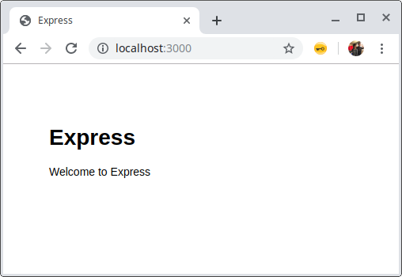
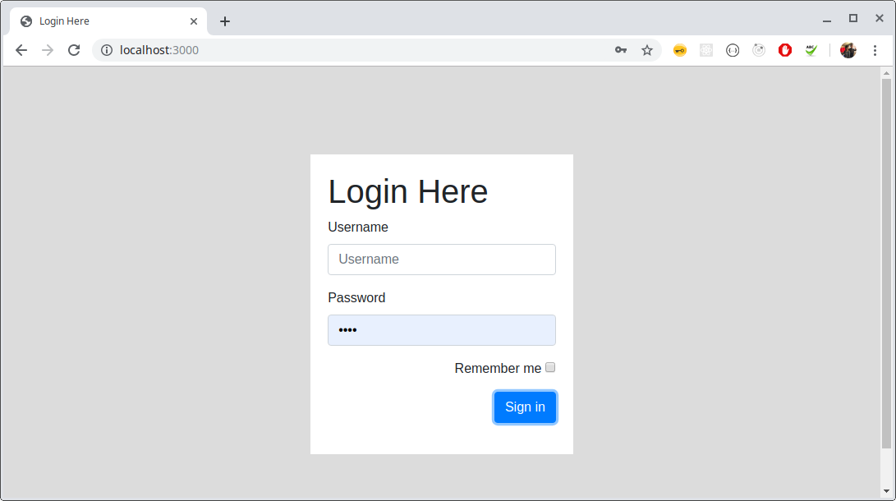
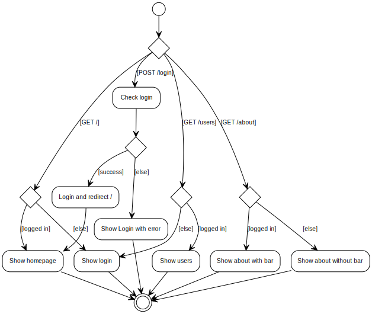
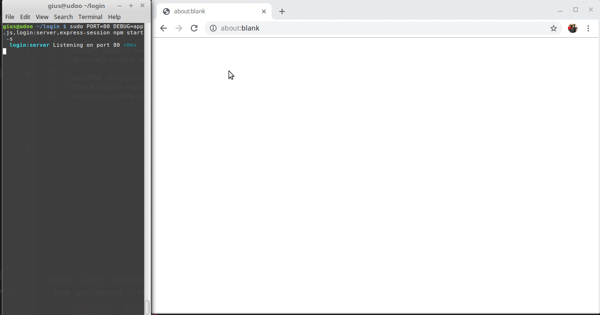
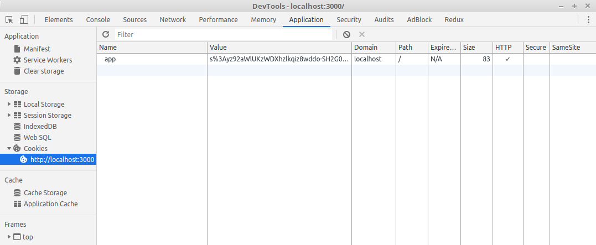

# Express login with express-session

Clone this repo or follow the steps below to learn about setting up a Node/express app that enables login, logout and secure routes.

| step          | instruction                                 |
| ------------- | ------------------------------------------- |
| **0. boilerplating** | These steps will set up an initial project. |
| 0.1 | Install [express-generator](https://www.npmjs.com/package/express-generator) globally `npm install -g express-generator`|
| 0.2 | Create a new project named **login** in a new folder **login** and add pug support (instead of Jade). `express -css=less --view=pug --git login` |
| 0.3 | Install dependencies by executing `npm i` after moving into the directory using `cd login` |
| 0.4 | You will see warnings, depending on how many vulnerabilities are found.  `npm notice created a lockfile as package-lock.json. You should commit this file. ` `added 118 packages from 174 contributors and audited 247 packages in 10.793s ` `found 1 low severity vulnerability run npm audit fix to fix them, or npm audit for details`  after running `npm audit` you will see recommendations to fix, you might want to run `npm ls` to see the dependency tree. In this case you can fix it by running `npm i pug@latest`  After running this no vulnerabilities are reported and we can go ahead and start the app |
| 0.5 | start the app by one of the following commands:   1. `npm start` - *to start app on default port 3000* 2. `PORT=8080 npm start` - *to start on port 8080* 3. `DEBUG=login:* npm start` - *start with debug information*|
| 0.6 | Point your browser to `localhost:3000`    In our console we see: `~/login$ DEBUG=login:* npm start`  `> login@0.0.0 start /home/gius/login` `> node ./bin/www`  `  login:server Listening on port 3000 +0ms` `GET / 304 719.979 ms - -` `GET /stylesheets/style.css 304 7.148 ms - -`
| **1. create login form** | After completing these steps we have a new page and route.|
| 1.1 | run `npm i --save express-session bootstrap` to add the dependency Note that bootstrap has 2 peer dependencies: jquery and popper.js. We don't need these, because we are just going to use the css. This is a list of ways to handle the `npm WARN`: 1. Ignore the warnings; *not desired because the team will ignore all npm output* 2. Install peer deps: `npm i --save jquery popper.js`; *not desired; packers will include jquery and popper.js and let the codebase grow significantly* 3. Install as dev deps: `npm i -D jquery popper.js`; *Unsure yet if it solves 2, but it shuts up the WARN* 4. Use [ignore-warings](https://github.com/codejamninja/ignore-warnings): *Unclear [how to use](https://github.com/codejamninja/ignore-warnings/issues/2) yet, but it seems like a legit way of avoiding 2 and still keep npm output clean* 5. use bootstrap cdn; *Preferred to install locally to allow offline dev* 6. manual install bootstrap; *deps should be in package.json for keeping all updatable and visable for npm audit*|
| 1.2 | create `/views/login.pug` [see change](https://github.com/rkristelijn/login/commit/e3c94bb22d43140f0a18054c793572fca60ce7ae#diff-6d5d452b8670045112ed889367008056) |
| 1.3 | add the route to `app.js` for reroute to login, bootstrap and include session [see change](https://github.com/rkristelijn/login/commit/e3c94bb22d43140f0a18054c793572fca60ce7ae#diff-0364f57fbff2fabbe941ed20c328ef1a)  |
| 1.4 | update styles `public/style.css` [see change](https://github.com/rkristelijn/login/commit/e3c94bb22d43140f0a18054c793572fca60ce7ae#diff-0aaa9d35a8082eda23139c53348d2e51) |
| 1.5 | update layout.pug to include bootstrap `views/layout.pug` [see change](https://github.com/rkristelijn/login/commit/e3c94bb22d43140f0a18054c793572fca60ce7ae#diff-5c5792469bc79f8d2ab44b4192b02a20) |
| 1.6 | current result routes default route to login  `~/login $ DEBUG=login:* npm start -s` `  login:server Listening on port 3000 +0ms` `GET / 304 737.652 ms - -` `GET /css/bootstrap.min.css 304 ` `.766 ms - -` `GET /stylesheets/style.css 304 1.070 ms - -` |
| **2. add about-page and header** | Follow below steps to add about page and header |
| 2.1 | Before we continue, I like to clean up some logging. `morgan` is creating too much noise. Remove the following lines from `app.js`: `var logger = require("morgan");` `app.use(logger("dev"));`  You can remove morgan from `package.json` by:  `npm rm --save morgan`.  While we are at it; `debug` is a direct dependency for `express` and `express-session` so we can remove it from our `package.json` by:  `npm rm --save debug`.  To see if `debug` still works, we can use: `DEBUG=app.js,login:server,express-session npm start -s`. Note that we can use `DEBUG=*` for all output.  Now we can add debug info like so (in app.js):  `var debug = require('debug')('app.js');`   `debug('hello world');`  Our output: `login:server Listening on port 3001 +0ms` `  express-session no SID sent, generating session +26s` `  app.js checkLoggedIn(), req.session.loggedIn: undefined rendering login +5ms` `  express-session saving PybLKV4TpsaSMx_PzZx_Mj5Is4X_0U9g +748ms` `  express-session set-cookie app=s%3APybLKV4TpsaSMx_PzZx_Mj5Is4X_0U9g.Bd1dSB8w4kfcL9DPonfLBXFRLtZBdqHThCNMTsv0Ixo; Path=/; HttpOnly +4ms` `  express-session fetching PybLKV4TpsaSMx_PzZx_Mj5Is4X_0U9g +736ms` `  express-session session found +1ms` `  app.js checkLoggedIn(), req.session.loggedIn: undefined rendering login +1ms` `  express-session saving PybLKV4TpsaSMx_PzZx_Mj5Is4X_0U9g +93ms` `  express-session split response +1ms`
| 2.2 | add `routes/about.js` and `views/about.pug` with [this content](https://github.com/rkristelijn/login/commit/e8c1317536cad9cde82169d40f05ffd68534e112#diff-8bd0aaff64e2da1404cfd91cce49a9f8) and update `app.js`; add:  `app.use("/about", aboutRouter);` `var aboutRouter = require("./routes/about");`|
| 2.3 | add `views/header.pug` with [this content](https://github.com/rkristelijn/login/commit/e8c1317536cad9cde82169d40f05ffd68534e112#diff-2e915f5980f834b4e8d3c8c06bcc292a) and include it in `index.pug` and `users.pug` and conditionally in `views/about.pug`: `if loggedIn` &nbsp;&nbsp;&nbsp;&nbsp;`include header` |
| 2.4 | then there are some bits and pieces to fix in `views/login.pug`: - add error placeholder - add link to about page - change button to input, so the enter key works |
| 2.5 | add `views/users.pug` with contents from [here](https://github.com/rkristelijn/login/commit/e8c1317536cad9cde82169d40f05ffd68534e112#diff-e804aa6e48ffa93374f7428688bf657b) and pass a list of users [like so](https://github.com/rkristelijn/login/commit/e8c1317536cad9cde82169d40f05ffd68534e112#diff-e9f8fcf8d0b7b7150ff1c16a7c69ea74) |
| **3. finalize login** | There still stuff left to do. The [examples](#sources) just support login and logout, and the session is killed after 6000 ms (6sec) |
|3.1| We can remove the line `cookie: {maxAge: 6000}` so the session isn't just 6sec from `app.js` |
|3.2| In `app.js` we create a `login()`- and a `logout()` function that only care about logging in and logging out.  Logout removes the session.loggedIn flag, Login sets it and calls checking the credentials. A separate function is created to check the credentials called `checkUser()` |

## Final design

## Final Demo
- clean start `/`
- get `/about`
- get `/users`
- login
- homepage
- get `/users`
- get `/about`
- logout
- wrong login

## Questions / evaluation

These are answers that I seek answer to before starting this document, raised during creation and reviewing the code.

| Question | Answer |
|---|---|
| Do I need passport and passport local for logging in? | no. Minimum is `express`, `express-session` and maybe `cookie-parse`|
| What is the simplest way of creating login/logout? Cookies? Server-side session?| This solution creates a cookie even when the user isn't logged in. This is a [session cookie](https://decodeproject.eu/cookies).   The value is `s%3Ayz92aWlUKzWDXhzlkqiz8wddo-SH2G0I.N6dzg2O0liagsejyMKLehW1aRGL6fEY1mkMrTFKOG1E` that seems to be the same value as the session on the server in the console of `DEBUG=express-session npm start -s`.  More on [cookie security](https://flaviocopes.com/cookies/)|
| Can I identify the user, so I can create access groups and allow different routes per user? | No. In this case only a boolean is stored: `Session {` &nbsp;&nbsp;&nbsp;&nbsp;`  cookie: { path: '/', _expires: null, originalMaxAge: null, httpOnly: true },` &nbsp;&nbsp;&nbsp;&nbsp;`loggedIn: true` `}`|
| Is this the simplest example? | For testing the session, you need at least 1 or 2 'secure' routes, login- and logout route and some kind of views. With a SPA the backend can be smaller. |
| is creating `req.session.loggedIn` a legit way to manage the session? | For now it seems ok. |
| What are generic security recommendations? | On the [express-session](https://github.com/expressjs/session#sessionoptions) page it says:  **Warning** The default server-side session storage, MemoryStore, is purposely not designed for a production environment. It will leak memory under most conditions, does not scale past a single process, and is meant for debugging and developing. It seems [MongoDB can store the session](https://www.npmjs.com/package/connect-mongodb-session).|

## Sources

1. [original tutorial](http://projectsplaza.com/login-logout-nodejs-express/)
2. [another tutor from Nima HKH](https://medium.com/@nima.2004hkh/create-your-first-login-page-with-exprerssjs-pug-f42250229486)
3. [node logging done right](http://www.jyotman.xyz/post/logging-in-node.js-done-right)

## Sponsor me

[Sponsor me](https://github.com/sponsors/rkristelijn/) if you appreciate my work.
